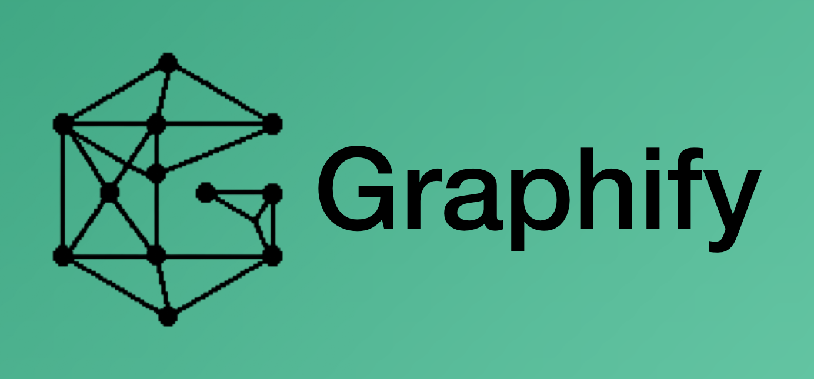

<div align="center">

<a href="https://www.graphify.com">
  
</a>

# Graphify Obsidian Visualizer

**Browse Graphify knowledge graphs inside Obsidian** — catalog cache maps, embed official `graph.html`, keep Node Info 1:1 with the web viewer.

Built on top of [Graphify](https://github.com/Graphify-Labs/graphify) by [Graphify Labs](https://www.graphify.com). This plugin is a **viewer bridge**, not an analyzer.

[](https://obsidian.md)
[](https://github.com/Graphify-Labs/graphify)
[](docs/ROADMAP.md)
[](docs/DECISIONS.md)
[](LICENSE)

[Website](https://www.graphify.com) · [Upstream CLI / skill](https://github.com/Graphify-Labs/graphify) · [App early access](https://app.graphify.com/login)

</div>


<p align="center"><em>Software repo → Graphify CLI → <code>~/.cache/graphify-lupa</code> → this plugin embeds <code>graph.html</code> in Obsidian.</em></p>

## Why this exists

[Graphify](https://github.com/Graphify-Labs/graphify) turns a codebase into a queryable knowledge graph (`graph.html` + `graph.json`). You already open that HTML in a browser.

**Graphify Obsidian Visualizer** puts the same official viewer next to your notes:

| Feature | What you get |
|---|---|
| **Catalog** | Lists every slug under `~/.cache/graphify-lupa` with json/html flags, node counts, code root |
| **Embed** | Official Graphify `graph.html` inside an Obsidian leaf (communities legend + Node Info) |
| **Browser escape hatch** | One click opens the same HTML in the system browser |
| **Filing cabinet** | Obsidian indexes and opens maps — Graphify CLI still cooks them |

## What it is not

- Not Obsidian’s built-in note graph
- Not a vault-wide indexer or second Graphify engine
- Not tree-sitter / Python analysis (that stays in [upstream Graphify](https://github.com/Graphify-Labs/graphify))
- Not mobile Refresh (desktop / Electron only)

## How the bridge works

```text
Software repo
  → Graphify CLI (/graphify or graphifyy)
  → ~/.cache/graphify-lupa/<slug>/graphify-out/{graph.html,graph.json}
  → This plugin: catalog → embed graph.html (blob iframe)
  → Node click → Graphify Node Info (same UX as web)
```

Architecture: [`docs/ARCHITECTURE.md`](docs/ARCHITECTURE.md) · decisions: [`docs/DECISIONS.md`](docs/DECISIONS.md) · diagram source: [`docs/assets/bridge-architecture.excalidraw`](docs/assets/bridge-architecture.excalidraw)

## Upstream

| Resource | URL |
|---|---|
| **Origin repo** | [github.com/Graphify-Labs/graphify](https://github.com/Graphify-Labs/graphify) |
| **Product site** | [www.graphify.com](https://www.graphify.com) |
| **Platform login** | [app.graphify.com](https://app.graphify.com/login) |

Install Graphify first (`uv tool install graphifyy` → `graphify install` → `/graphify .` in your assistant). Then use this plugin to browse the resulting maps in Obsidian.

## Status

| Phase | State |
|---|---|
| Fase 0 — ItemView scaffold | Done |
| Fase 1 — catalog of cache graphs | Done |
| Fase 2 — open `graph.html` in browser | Done |
| Fase 3 — embed official `graph.html` in Obsidian | Done |
| Fase 4 — Refresh via CLI subprocess | Next |

Track: [`docs/ROADMAP.md`](docs/ROADMAP.md)

## Quick start

```bash
git clone git@github.com:TheVeller/graphify-visualizer.git
cd graphify-visualizer/plugin
bun install && bun run build
# symlink plugin/ → <vault>/.obsidian/plugins/graphify-visualizer
```

Enable **Graphify Obsidian Visualizer** in Obsidian → command **Open Graphify Visualizer**.

Expect maps at:

`~/.cache/graphify-lupa/<slug>/graphify-out/graph.html`

Details: [`plugin/README.md`](plugin/README.md)

## Repo map

```text
graphify-visualizer/
├── README.md
├── AGENTS.md
├── LICENSE
├── docs/                 # architecture, ADRs, roadmap, brand assets
├── Development-Log/
└── plugin/               # Obsidian plugin (esbuild → main.js)
```

## Topics / search keywords

`obsidian` · `obsidian-plugin` · `graphify` · `knowledge-graph` · `code-map` · `graph-visualization` · `pkm` · `typescript` · `desktop`

## Contributing

Issues and PRs welcome on docs, bridge UX, and schema mismatches against real `graph.json` / `graph.html`.

Agent rules: [`AGENTS.md`](AGENTS.md)

## License

[MIT](LICENSE) — plugin code. Graphify itself is owned by [Graphify Labs](https://github.com/Graphify-Labs/graphify); this repo only embeds their generated `graph.html`.
