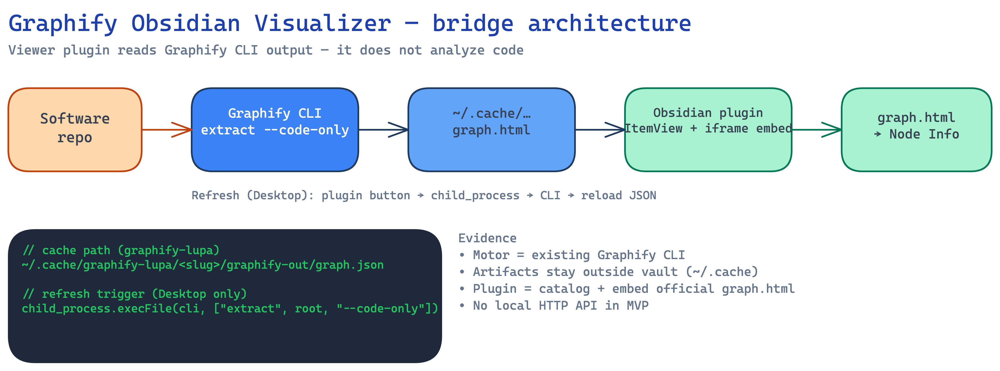

<div align="center">

<pre>
╔══════════════════════════════════════════════╗

   ██████╗ ██╗   ██╗
  ██╔════╝ ██║   ██║
  ██║  ███╗██║   ██║
  ██║   ██║╚██╗ ██╔╝
  ╚██████╔╝ ╚████╔╝
   ╚═════╝   ╚═══╝

  GRAPHIFY VISUALIZER
  Obsidian plugin  ·  CLI bridge  ·  click → file

╚══════════════════════════════════════════════╝
</pre>

### Graphify Visualizer

**Turn Graphify `graph.json` into a clickable map inside Obsidian.**  
The plugin is a **viewer bridge** — it does not analyze code.

[](docs/ROADMAP.md)
[](docs/DECISIONS.md)
[](LICENSE)

</div>



## What it does

Graphify already answers in the terminal (`extract`, `path`, `explain`).  
This plugin turns the same **code-only** graph into an interactive Obsidian view:

| Capability | MVP intent |
|---|---|
| **Read** `graph.json` from Graphify cache | Settings path → ItemView |
| **Render** dependency network | vis-network |
| **Open** source on node click | `app.workspace.openLinkText` |
| **Refresh** without leaving Obsidian | Desktop: button → CLI subprocess |

## What it is not

- Not Obsidian’s note graph
- Not a whole-vault indexer
- Not a new tree-sitter / Python analysis engine
- Not Excalidraw freehand drawing
- Not a local HTTP API (CLI subprocess only)
- Not mobile Refresh (Desktop / Electron)

## How the bridge works

```text
Software repo
    → Graphify CLI  extract --code-only
    → ~/.cache/graphify-lupa/<slug>/graphify-out/graph.json
    → This plugin (ItemView + vis-network)
    → click node → open file in editor
```

Full write-up: [`docs/ARCHITECTURE.md`](docs/ARCHITECTURE.md) · decisions: [`docs/DECISIONS.md`](docs/DECISIONS.md)

## Status

| Phase | State |
|---|---|
| Scaffold (docs + repo) | Done |
| Fase 0 — empty ItemView boilerplate | Next |
| Fase 1 — read-only viewer | Planned |
| Fase 2 — Refresh → CLI | Planned |
| Fase 3 — settings + errors | Planned |

Track: [`docs/ROADMAP.md`](docs/ROADMAP.md)

## Quick start (today)

Repo is **docs-first**. Plugin TypeScript under `plugin/` is not scaffolded yet.

```bash
git clone git@github.com:TheVeller/graphify-visualizer.git
cd graphify-visualizer
# next: Fase 0 under plugin/ — empty Obsidian ItemView
```

Generate a graph with Graphify / graphify-lupa (outside this repo), then point the future plugin at:

`~/.cache/graphify-lupa/<slug>/graphify-out/graph.json`

## Repo map

```text
graphify-visualizer/
├── README.md
├── AGENTS.md
├── LICENSE
├── docs/
│   ├── ARCHITECTURE.md
│   ├── DECISIONS.md
│   ├── ROADMAP.md
│   └── assets/           # Excalidraw + PNG
├── Development-Log/
└── plugin/               # Obsidian plugin source (empty until Fase 0)
```

## Contributing

Private repo — collaborate with the owner.  
Non-code help welcome: tighten docs, critique the bridge diagram, report schema mismatches against real `graph.json`.

Agent rules: [`AGENTS.md`](AGENTS.md)

## License

[MIT](LICENSE)
